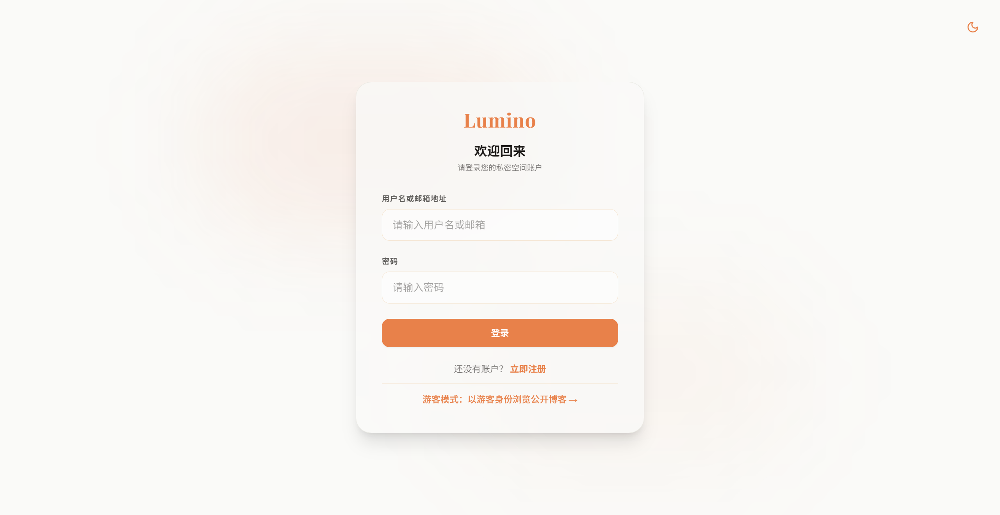
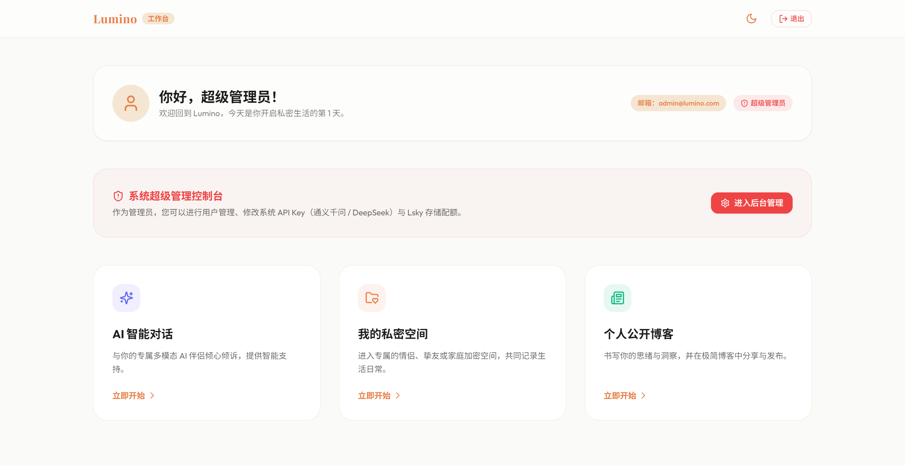
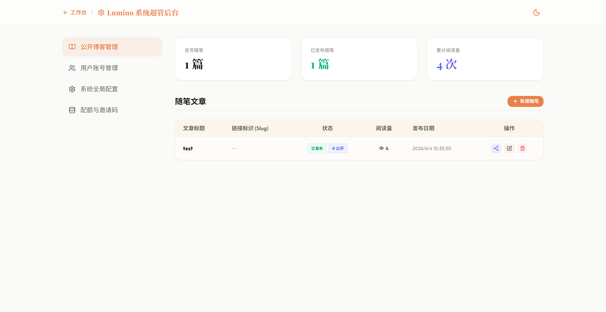
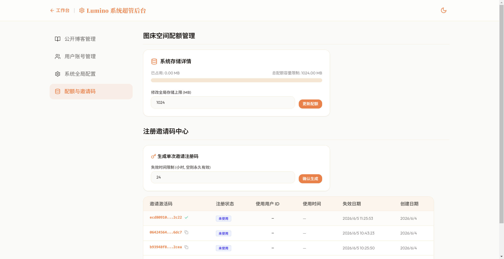
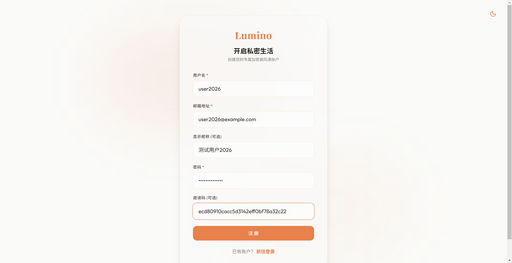
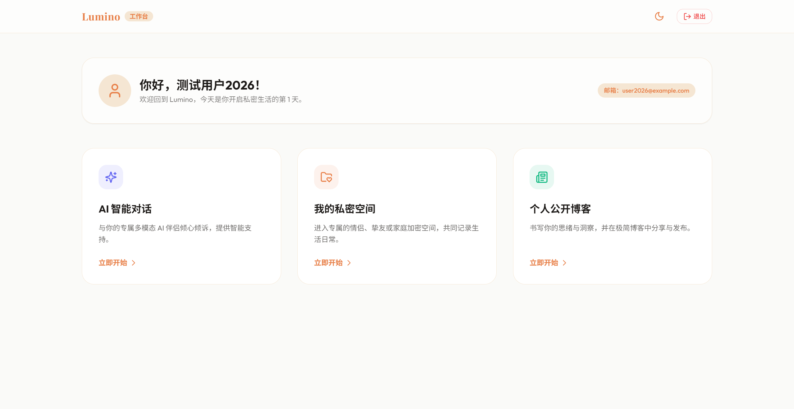
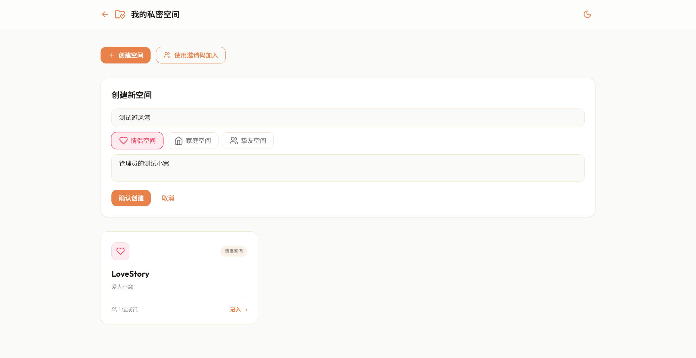
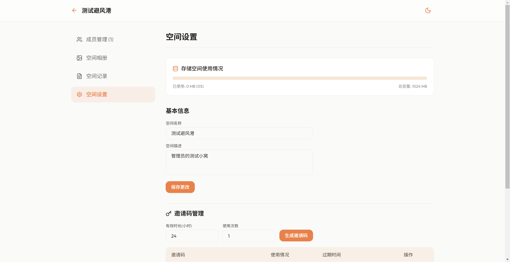
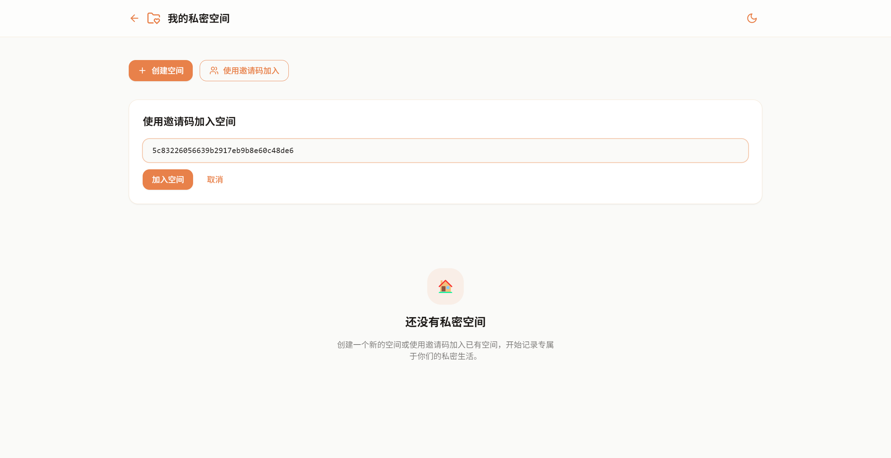
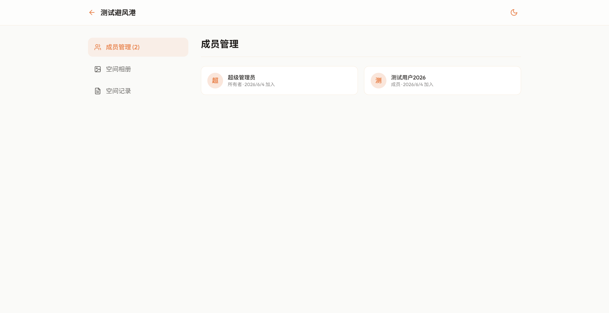

# Lumino v1.0 细节优化与全流程测试指南

本仓库已完成 Lumino v1.0 核心功能的全部细节优化与功能补全。为确保系统稳定并便于测试，我们进行了全流程的联调测试与功能截图。

以下是完整的系统测试演示与说明：

---

## 1. 全流程测试演示

### 1.1 游客模式与登录引导
登录页面底端新增了 **“游客模式：以游客身份浏览公开博客 →”** 的快捷入口，且拦截器已将博客（`/blog` 和 `/blog/*`）设置为公共免签路由，免除未登录强制跳转。



---

### 1.2 超级管理员工作台
使用超级管理员账户安全登录后，进入系统仪表盘，可快捷跳转“进入后台管理”和各类空间。



---

### 1.3 博客随笔一键分享
进入后台管理，超管可在公开随笔列表的行操作栏点击 **“复制分享链接”**，系统将自动组合并复制域名下真实的独立单页路径（例如 `http://localhost:3000/blog/[slug]`），并伴有成功的 Toast 提醒。



---

### 1.4 自定义生成并复制邀请码
超管可在“配额与邀请码”分区，生成系统注册所需的单次邀请码。点击复制后，将生成个性化的邀请信模版，包含管理员称呼、注册页面完整地址和该激活码。



---

### 1.5 模拟新用户注册
获取邀请码后，模拟另一位用户访问 `/register` 注册。邀请码被成功填入表单，且校验通过。



---

### 1.6 新用户注册并登录
注册成功后，新用户被自动执行登录，引导至专属的工作台面板。



---

### 1.7 管理员创建私密空间
回到超级管理员账户，在“我的私密空间”页面点击 **“创建空间”**，填入空间名称与介绍，并选择空间类型（如情侣空间）确认创建。



---

### 1.8 生成空间邀请码
管理员进入新建的空间面板，切换到 **“空间设置”** 选项卡，在邀请码管理中输入时长与次数，成功生成针对本空间的加入邀请码。



---

### 1.9 新用户输入邀请码加入空间
退出管理员账号并重新以新用户身份登录。进入“我的私密空间”页面，点击 **“使用邀请码加入”** 并在弹窗中粘贴刚才管理员生成的空间邀请码。



---

### 1.10 成功加入并实时同步成员
新用户成功被添加进空间，此时成员管理信息更新为 **2位成员**，共同列表已包含了超级管理员（所有者）及测试用户（新成员）。



---

## 2. 本地测试运行方法

如果需要再次手动测试，请确保以下环境配置并运行：

### 2.1 后端启动
进入 `backend` 文件夹，激活虚拟环境并启动 Uvicorn：
```bash
cd backend
.\venv\Scripts\activate
uvicorn app.main:app --host 0.0.0.0 --port 8000 --reload
```

### 2.2 前端启动
进入 `frontend` 文件夹，开启开发服务：
```bash
cd frontend
npm run dev
```
然后即可通过本地浏览器 `http://localhost:3000` 尽情测试。
